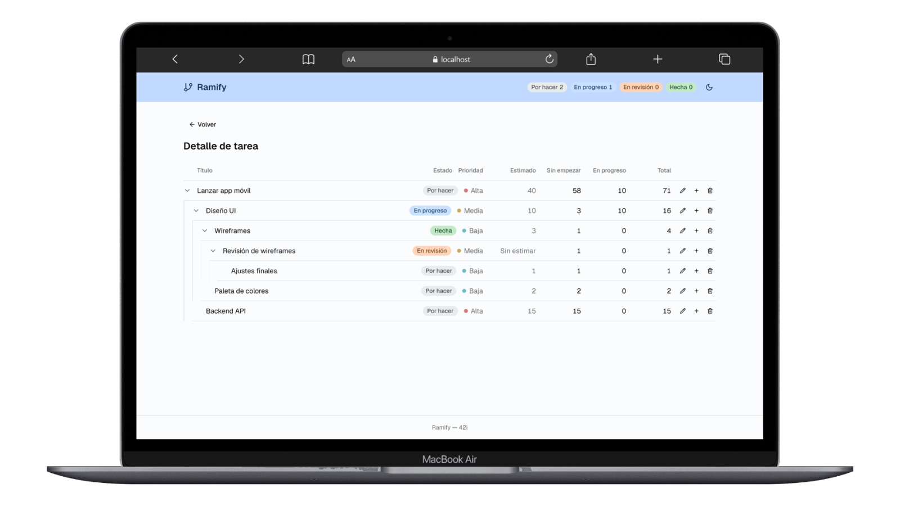
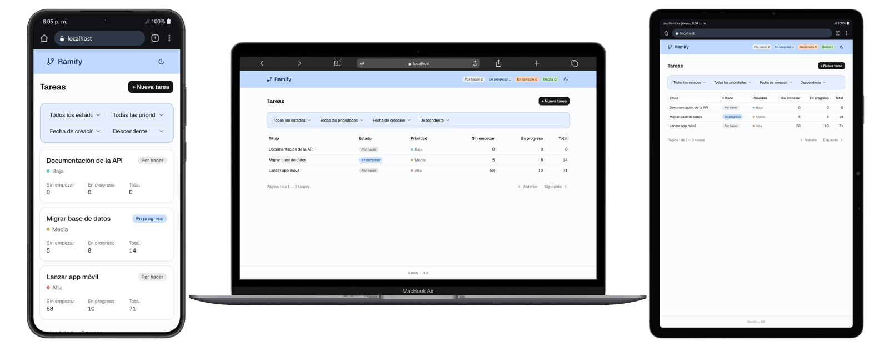

# Ramify

Sistema de gestión de tareas para equipos de desarrollo: CRUD con subtareas anidadas de
profundidad arbitraria y agregación de esfuerzo sobre todo el árbol.




## Stack

- **API** — Node + TypeScript + Express + PostgreSQL (`pg`, SQL crudo, sin ORM)
- **Web** — React + Vite + Tailwind + shadcn/ui
- **Tests** — Vitest

## Funcionalidad

- CRUD completo de tareas, con subtareas anidadas de profundidad arbitraria
- Ciclo de vida en cuatro estados y tres niveles de prioridad
- Estimación de esfuerzo opcional, agregada sobre todo el subárbol
- Listado paginado, con filtros por estado y prioridad, y ordenamiento configurable
- Árbol de subtareas colapsable, con guías de indentación por nivel
- Confirmación de borrado en cascada, indicando cuántas subtareas se van a eliminar
- Tema claro y oscuro
- Diseño responsive

## Requisitos previos

Docker Desktop (o Docker Engine) con Compose v2. Nada más: no hace falta Node ni Postgres
instalados localmente.

Los puertos `3000` y `5433` del host tienen que estar libres.

## Levantar la app

```bash
docker compose up --build
```

La aplicación queda en **http://localhost:3000** — Express sirve el build de React como
estático desde el mismo puerto que la API. No hay un servidor de frontend aparte: el build de
Vite se compila en una etapa del Dockerfile y se copia dentro de la imagen del API.

La primera vez, Postgres aplica `db/schema.sql` y `db/seed.sql` automáticamente vía
`/docker-entrypoint-initdb.d/`. El seed carga tres tareas raíz, una de ellas con un árbol de
cinco niveles, con los cuatro estados presentes y prioridades mezcladas.

Postgres queda expuesto en `localhost:5433` por si querés inspeccionar la base directamente
(usuario, contraseña y base: `task_system`).

## Correr los tests

```bash
docker build --target test -t task-system-test .
docker run --rm task-system-test
```

Los tests unitarios cubren la lógica de negocio pura: la construcción del bosque de tareas y la
agregación de esfuerzo sobre el subárbol, con árboles armados a mano y sin base de datos
corriendo. Esa separación es lo que los hace unitarios de verdad y no tests de integración
disfrazados.

## API

Base: `http://localhost:3000`

| Método   | Ruta         | Descripción                                          |
| -------- | ------------ | ---------------------------------------------------- |
| `GET`    | `/health`    | Healthcheck                                          |
| `GET`    | `/tasks`     | Listado paginado de tareas raíz                      |
| `GET`    | `/tasks/:id` | Detalle de una tarea con su subárbol completo        |
| `POST`   | `/tasks`     | Crear tarea (con `parentId` opcional)                |
| `PATCH`  | `/tasks/:id` | Actualizar tarea                                     |
| `DELETE` | `/tasks/:id` | Eliminar tarea y todo su subárbol                    |

Query params de `GET /tasks`:

| Param      | Valores                                          | Default     |
| ---------- | ------------------------------------------------ | ----------- |
| `page`     | entero ≥ 1                                       | `1`         |
| `limit`    | entero 1–100                                     | `20`        |
| `sortBy`   | `createdAt`, `updatedAt`, `priority`, `title`    | `createdAt` |
| `order`    | `asc`, `desc`                                    | `desc`      |
| `status`   | `TODO`, `IN_PROGRESS`, `IN_REVIEW`, `DONE`       | —           |
| `priority` | `LOW`, `MEDIUM`, `HIGH`                           | —           |

Ejemplo con los datos del seed — la raíz con el árbol de cinco niveles:

```bash
curl http://localhost:3000/tasks/10000000-0000-0000-0000-000000000001
```

## Alcance del listado (`GET /tasks`)

El listado devuelve **solo tareas raíz**, paginadas. `?status=` y `?priority=` filtran qué
raíces aparecen, no los nodos dentro de un subárbol — es una restricción deliberada, no una
omisión: paginar sobre un árbol filtrado no tiene una respuesta única. El detalle de una tarea
(`GET /tasks/:id`) siempre muestra su subárbol completo, sin filtrar.

## Decisiones técnicas

- **`parentId` es inmutable después de la creación.** Se rechaza en el `PATCH`. Garantiza que
  el `WITH RECURSIVE` siempre termine, sin necesidad de detección de ciclos.
- **Un solo query para todo el subárbol.** El CTE recursivo se siembra con
  `id = ANY($1::uuid[])` a partir de los IDs de la página, evitando N+1.
- **La agregación de esfuerzo es una función pura de TypeScript**, separada de la base. Es lo
  que permite testearla sin Postgres corriendo.
- **Todo el SQL vive en la capa de repositorios.** El texto del cliente nunca toca el SQL: el
  `ORDER BY` se resuelve contra un mapa whitelist cerrado, porque los identificadores de
  columna no admiten placeholders.
- **Imagen única multi-stage.** El build de Vite se compila en una etapa aparte y se copia
  dentro de la imagen del API, que lo sirve como estático. Un puerto, un comando.

El desarrollo se hizo con Claude Code en modo manual: cada cambio pasó por un plan revisado
antes de ejecutarse y por una revisión de diff antes de commitearse. Ver
[CLAUDE.md](./CLAUDE.md) — el archivo de instrucciones del agente — para el modelo de datos
completo, el contrato de la API y las convenciones de código.

## Bajar todo y resetear la base

```bash
docker compose down -v
```

El flag `-v` borra el volumen de Postgres. Es necesario si querés que `schema.sql` y `seed.sql`
vuelvan a aplicarse: `/docker-entrypoint-initdb.d/` solo corre con el volumen de datos vacío.

## Responsive



El listado usa tabla en pantallas anchas y cards apiladas en mobile.

## Sobre el enrutado

La API y el enrutado del cliente comparten el namespace `/tasks/:id`. Navegando dentro de la
app funciona normalmente — React resuelve la vista sin consultar al servidor — pero pegar esa
URL directamente en el navegador devuelve el JSON de la API en lugar de la interfaz.

La solución es montar la API bajo un prefijo `/api`, dejando `/tasks/*` libre para el cliente.
No lo apliqué en esta entrega porque implica tocar el router de Express, el cliente HTTP del
frontend y toda la documentación de endpoints, y preferí no introducir un cambio transversal
sin margen para verificarlo end to end.
